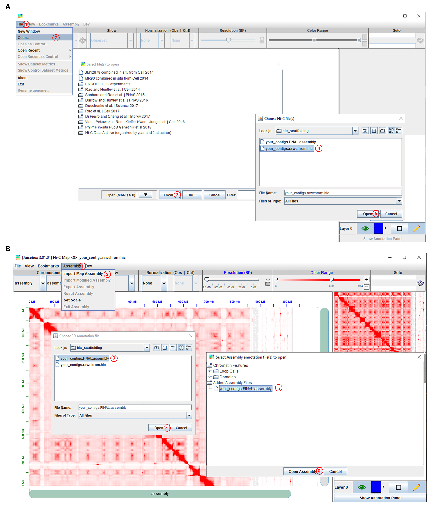
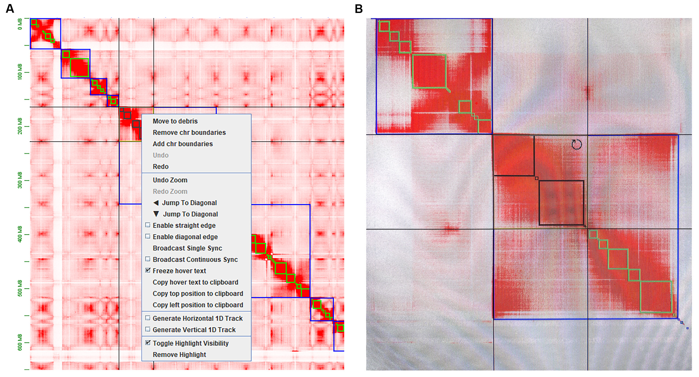
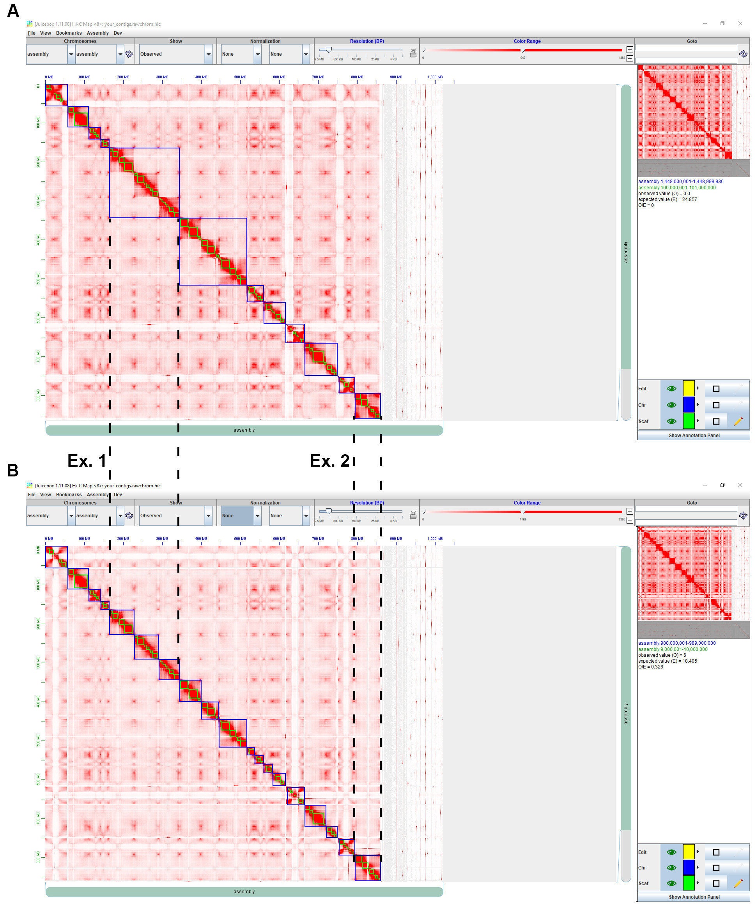
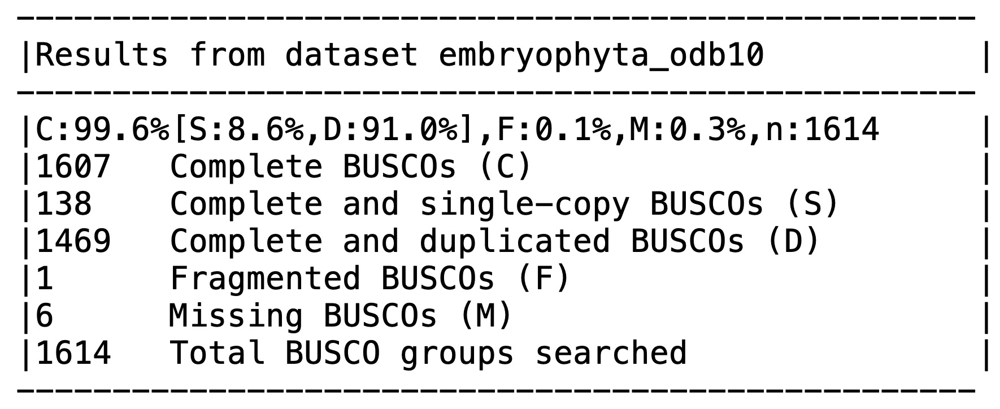

[](http://www.gnu.org/licenses/gpl-3.0)

# Contigs scaffolding with Hi-C for plant genomes
This repository is made for eBook entitled “Bioinformatics Recipes for Plant Genomics: Data, Code, and Workflows” in [Bio-101](https://cn.bio-protocol.org/bio101/default.aspx)

Hi-C is a chromosome conformation capture method that was originally developed to detect genome-wide chromatin interactions. Nowadays, it is widely applied in scaffolding de novo assembled contigs into chromosome-scale genome sequences. Multiple open-source software has been developed to perform genome scaffolding with Hi-C data. The input data is de novo assembled contigs using long-read sequencing or next-generation sequencing. Then, Hi-C data is mapped to these contigs and the interact matrix is computed by software to scaffold contigs into chromosome-scale sequences. Different tools have their specific algorithm to calculate the interaction matrix, correct misassembly and misjoins, and also may require different dependent packages or running environments. Here, we describe a step-by-step protocol for genome scaffolding using Hi-C data with a comprehensive pipeline: compute interact matrix with Juicer, scaffold contigs with 3D-DNA pipeline, then visualize and modify scaffolding with Juicebox. This pipeline only requires primarily assembled contigs and Hi-C data as inputs, is compatible with multiple enzymes, and also provides visualization and manual correction. With these advantages, this pipeline has been used in mass big eukaryotic genome scaffolding.

## Software dependencies
[Trimmomatic](http://www.usadellab.org/cms/?page=trimmomatic)  
[Juicer](https://github.com/aidenlab/juicer/)   
[3D-DNA pipeline](https://github.com/aidenlab/3d-dna)   
[Juicebox](https://github.com/aidenlab/Juicebox)   
[BWA](http://bio-bwa.sourceforge.net/)   
[Samtools](http://www.htslib.org/)   
[BUSCO](https://gitlab.com/ezlab/busco)   
[Java 1.8 JDK](https://www.oracle.com/java/technologies/downloads/#java8)   

## Input data
1. _De novo_ assembly contigs file in FASTA format, contigs used in this study can be downloaded [HERE](https://zenodo.org/record/6383215#.YjzdkufMKCp)   
2. Raw Hi-C sequencing data in FASTQ format, fastq files used in this study can be downloaed [HERE](https://www.ncbi.nlm.nih.gov/bioproject?term=PRJNA816043&cmd=DetailsSearch&log$=activity)

## Procedure
More details can be found in the paper

### 1. Equipment required:
a. Linux server or cluster with SLURM or SLF scheduler   
b. PC with at least 16GB RAM for handling big genomes (>1GB)
### 2. Install and configure Juicer
```
mkdir hic; cd hic

git clone https://github.com/theaidenlab/juicer.git

ln -s juicer/SLURM/scripts/ scripts

cd scripts; wget https://hicfiles.tc4ga.com/public/juicer/juicer_tools.1.9.9_jcuda.0.8.jar
ln -s juicer_tools.1.9.9_jcuda.0.8.jar juicer_tools.jar; cd ../

mkdir references
mkdir restriction_sites
```
### 3. Prepare input data for Juicer
a. Copy your_contigs.fasta file (or make soft link) into reference path, and index it with bwa index 
```
ln -s your_path/your_contigs.fasta ./references
cd ./references; bwa index your_contig.fasta; cd ..
```
b. Prepare enzyme site file for your_contigs.fasta
```
cd restriction_sites
wget https://raw.githubusercontent.com/aidenlab/juicer/main/misc/generate_site_positions.py
```
Then, Use vi or vim to edit generate_site_positions.py, insert the following line in line 25:
```
'your_contigs': '../references/your_contigs.fasta',
```
After that:
```
python generate_site_positions.py DpnII your_contigs
awk 'BEGIN{OFS="\t"}{print $1, $NF}' your_contigs_DpnII.txt > your_contigs.chrom.sizes
cd ..
```
c. Filter and clean raw Hi-C sequencing data
```
wget https://github.com/usadellab/Trimmomatic/files/5854859/Trimmomatic-0.39.zip
unzip Trimmomatic-0.39.zip

java -jar ./Trimmomatic-0.39/trimmomatic-0.39.jar PE -threads 12 -phred33 -trimlog trimmomatic.log your_hic_R1.fastq.gz your_hic_R2.fastq.gz your_hic_pair_R1.fastq.gz your_hic_unpair_R1.fastq.gz your_hic_pair_R2.fastq.gz your_hic_unpair_R2.fastq.gz ILLUMINACLIP:TruSeq3-PE.fa:2:30:10 LEADING:3 TRAILING:3 SLIDINGWINDOW:4:15 MINLEN:36
```
### 4. Run Juicer to obtain the interaction matrix
```
mkdir your_contigs_hic; cd your_contigs_hic
mkdir fastq
ln -s ../your_hic_pair* ./fastq/

sh ../scripts/juicer.sh -D $pwd/hic -g your_contigs -s DpnII -p ../restriction_sites/your_contigs.chrom.sizes -y ../restriction_sites/your_contigs_DpnII.txt -z ../references/your_contig.fasta -Q 2-00:00 -L 7-00:00 -q your_queue_name -l your_long_queue_name -t 24 -A your_account --assembly

cd ..
```
__Tips:__ Check _juicer.sh_, make sure all the Partition, Account, QOS and Threads fit your SLURM or SLF scheduler. To be safe, add these parameters to your command line or modify _juicer.sh_ manually.  
Juicer will submit jobs to the cluster through the scheduler automatically. After all the jobs are done, the file named __merged_nodups.txt__ in __your_contigs_hic/aligned__ will be used by 3D-DNA pipeline.

### 5. Run 3D-DNA pipeline
```
wget https://github.com/aidenlab/3d-dna/archive/refs/tags/201008.tar.gz
tar -zxf 201008.tar.gz
chmod 554 ./3d-dna-201008/*.sh  ##add execute permission

cd your_contigs_hic
../3d-dna-201008/run-asm-pipeline.sh ../references/your_contigs.fasta ./aligned/merged_nodups.txt
```
__Tips:__ If the scaffolding results are not ideal, try different _--round_ different edit round and slightly increase _--editor-repeat-coverage_ misjoin editor threshold repeat coverage. In this case study, we use --editor-repeat-coverage 3.
After the job is done. Two files named __your_contigs.rawchrom.assembly__ and __your_contigs.rawchrom.hic__ will be used by Juicebox

### 6. Visualize and modify the scaffolding with Juicebox
a. Download Juicebox v1.11.08 from https://github.com/aidenlab/Juicebox/wiki/Download  
b. Download your_contigs.FINAL.assembly and your_contigs.rawchrom.hic to your PC  
c. Run Juicebox, then load  your_contigs.rawchrom.hic and  your_contigs.FINAL.assembly in turn (Figure 1)  


__Figure 1. Steps to load .hic and .assembly file to Juicebox.__ A. Load .hic file; B. Load .assembly file.   
d. Correct scaffolding manually (Figure 2 and Figure 3)   
1. Shift+left-click to choose the region that needs to be edited.   
2. Right-click to choose to remove or add chr boundaries.   
3. Move the mouse to the upper-right of the selected region until a circle appears, and then left-click to rotate the selected region   

__Figure 2. Examples of how to edit misjoin and misorientation.__ A. edit misjoin via remove and add chr boundaries. B. edit misorientation by rotating scaffold.  

__Figure 3. Manually correct the scaffolding with Juicebox.__ A. the original scaffolding visilization B. manually corrected scaffolding. Ex. 1: misjoin, Ex. 2: mis-oritention

### 7. Run 3D-DNA pipeline again to update the manual modification
a. Upload your_contigs.FINAL.edit.assembly to cluster and put it in your_contigs_hic.
b. Run 3D-DNA pipeline to obtain your edited scaffolds fasta file
```
../3d-dna/run-asm-pipeline-post-review.sh -r your_contigs.FINAL.edit.assembly ../references/your_contigs.fasta aligned/merged_nodups.txt
```
### 8. Primarily estimate the scaffolding with BUSCO
a. Install BUSCO, and download database
```
conda install -c bioconda busco

mkdir busco_evalue; cd busco_evalue
wget https://busco-data.ezlab.org/v4/data/lineages/embryophyta_odb10.2020-09-10.tar.gz
tar -zxf embryophyta_odb10.2020-09-10.tar.gz
```
b. Run BUSCO
```
busco -c 14 -m genome -i ../your_contigs_hic/your_contigs_HiC.fasta -o your_contigs_hic_busco -l ./embryophyta_odb10
```
c. Check the BUSCO value and components (Figure 4)


__Figure 4. BUSCO summary information.__
## License
It is a free and open source software, licensed under [GPLv3](https://github.com/github/choosealicense.com/blob/gh-pages/_licenses/gpl-3.0.txt)
